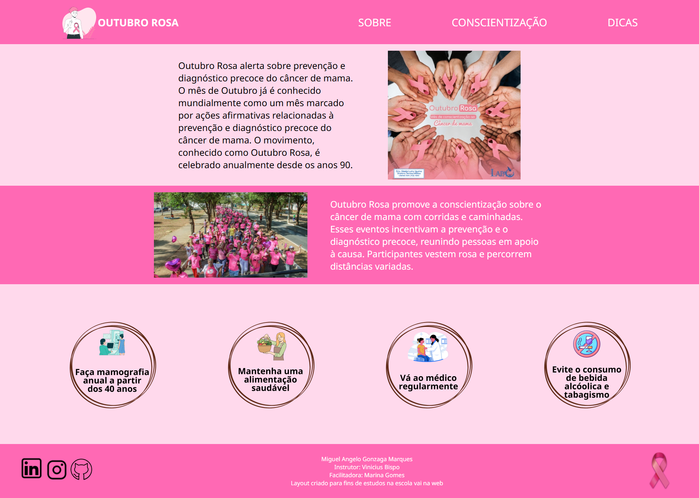

# 🩷 Desafio Outubro Rosa

## 📜 Descrição
Este projeto é uma iniciativa do "Vai na Web" para promover a conscientização sobre o câncer de mama durante o mês de outubro. O objetivo é criar uma landing page temática para aprendizado de HTML e SASS, além da iniciação dos conceitos iniciais de responsividade.

## 🌐 Deploy da página
[Link para o projeto](https://desafio-outubro-rosa-sand.vercel.app/)

## 🖼️ Prévia

## ⚙️ Construção

Recursos utilizados na construção do projeto.

### 💻 Tecnologias

### 🛠️ Ferramentas

